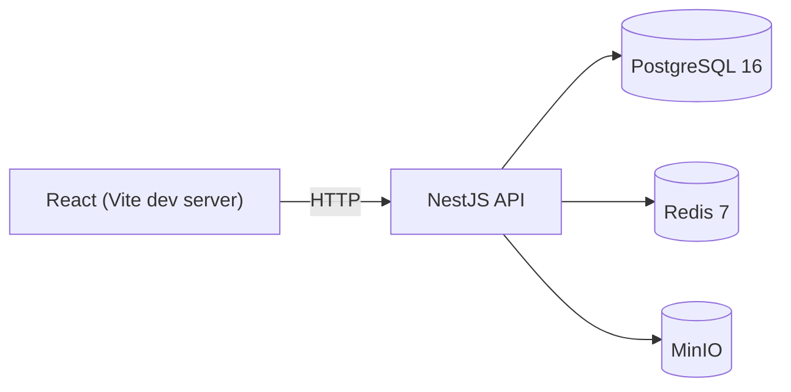

# Architecture

> This document reflects the current state of the system and grows with each build phase.

## Phase 1 — Foundation

- **Web** — React 18 + TypeScript SPA served by Vite in dev mode. Talks to the API over plain HTTP for now (no sockets yet).
- **API** — NestJS app exposing a single `GET /health` endpoint backed by a real Prisma → Postgres round trip via `@nestjs/terminus`.
- **Postgres** — holds the full data model (User, Channel, ChannelMember, Message, Attachment, LinkPreview, TicketRef, AuditLog) via Prisma migrations, even though only the schema exists so far — no feature writes to it yet.
- **Redis** — running and healthy, not yet wired into any application code (arrives with the Socket.IO adapter and session storage in Phase 3).
- **MinIO** — running and healthy with an auto-created bucket, not yet wired into any application code (arrives with file uploads in Phase 4).

`packages/shared` provides TypeScript types shared between `apps/api` and `apps/web`, built to `dist/` and consumed as a normal npm workspace dependency by both apps. In Phase 1 it only carries the Prisma enum mirrors and the `HealthResponse` zod DTO.

## Not yet present

Active Directory / LDAPS auth, department channel sync, the Socket.IO chat gateway, GLPI ticket integration, file uploads, and link previews are out of scope for Phase 1 — see the module `README.md` stubs under `apps/api/src/*` for which phase implements each one.
