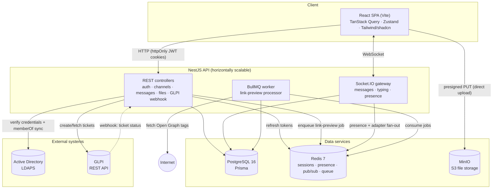
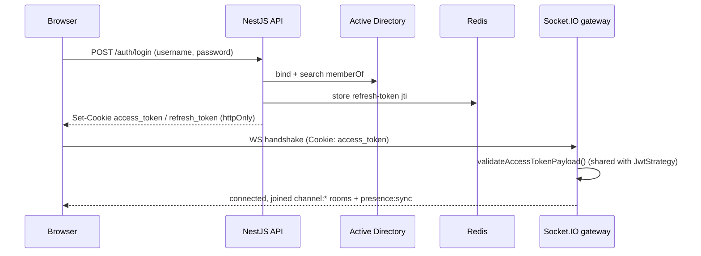
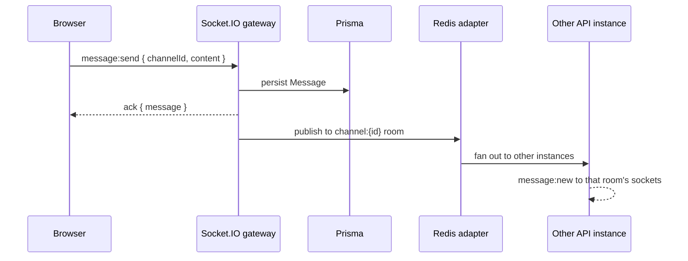

# Architecture

> This document reflects the current state of the system (Phases 1–5 complete,
> Phase 6 partial). For a module-by-module walkthrough in pt-BR, see
> [estrutura-do-codigo.md](estrutura-do-codigo.md).

## System overview

## Components

- **Web** — React 18 + TypeScript SPA served by Vite. Server state via TanStack
  Query, live chat state in a small Zustand store, UI from Tailwind + shadcn/ui.
  `SocketProvider` owns the single `socket.io-client` connection, mounted only
  inside the authenticated layout so `/login` never opens a socket.
- **API** — one NestJS app. REST controllers back auth, channel list, message
  history, file presign, and the GLPI webhook; the Socket.IO gateway handles the
  live traffic (send/edit/delete, typing, presence).
- **PostgreSQL** — system of record via Prisma. Message history is keyset
  paginated (`@@index([channelId, createdAt, id])`).
- **Redis** — refresh-token store, presence structures, Socket.IO adapter pub/sub,
  and BullMQ backend.
- **MinIO** — S3-compatible object storage for attachments; uploaded directly from
  the browser via presigned URLs.
- **Active Directory (LDAPS)** — authentication and department-channel source.
- **GLPI** — helpdesk ticketing via REST, with an inbound webhook for status.

## Authentication and realtime auth

- **Single source of truth** — `access-token.validator.ts` is the one place that
  decides whether an access token is still valid (user active, `tokenVersion`
  matches). Both the HTTP `JwtStrategy` and the WebSocket `ChatAuthService` call
  it, so REST and socket auth can never diverge.
- **Token model** — short-lived access token + rotating, single-use refresh token
  whose `jti` is tracked in Redis (revocation). Bumping `User.tokenVersion`
  invalidates every session at once.
- **Channel sync** — on login, the user's AD `memberOf` groups are reconciled into
  `ChannelMember` rows (conflict-safe inserts + pruning of groups they left).

## Realtime message flow

- On connect, a socket joins a `channel:{id}` room for every channel the user
  belongs to (memberships only change at login).
- `typing:start/stop` are stateless relays. Presence is backed by a per-user
  Redis counter (multi-tab correct) plus an online-user set.
- Horizontal scaling comes from `@socket.io/redis-adapter`, which uses dedicated
  pub/sub connections so `socket.to(room).emit(...)` reaches sockets on other
  API instances.

## Rich content

- **File uploads** — the browser requests a presigned URL, uploads directly to
  MinIO, then sends the message; the API validates the object's real size against
  what the client claimed before persisting the `Attachment`.
- **Link previews** — a message containing a URL enqueues a BullMQ job; a worker
  fetches the page's Open Graph tags behind an SSRF guard (rejects private/reserved
  IPs, including the cloud metadata endpoint) and persists a `LinkPreview`, then
  broadcasts the updated message.

## GLPI ticketing

- `/ticket <description>` in chat creates a GLPI ticket over REST and posts a
  ticket card into the channel.
- GLPI calls back to `POST /webhooks/glpi/tickets` (HMAC-SHA256 signed, verified
  with a constant-time compare); the API re-fetches authoritative status and
  broadcasts the updated card over the chat socket.

## Deployment

- **Local dev** — `docker/docker-compose.yml` runs Postgres, Redis, MinIO, and
  OpenLDAP.
- **Production** — multi-stage Docker images for the API and web, plus Kubernetes
  manifests under `k8s/` (deployments, services, HPA for the API, an ingress, and
  a Prisma migration Job).
- **CI** — `.github/workflows/ci.yml` runs lint, typecheck, unit + e2e tests, and
  Docker image builds against real Postgres, Redis, OpenLDAP, and MinIO
  containers.

## Not yet implemented

Full-text search, rate limiting, PWA, and browser notifications (the remaining
Phase 6 items) — see [prompt-fase-6.md](prompt-fase-6.md). The `AuditLog` model
exists in the schema but nothing writes to it yet.
